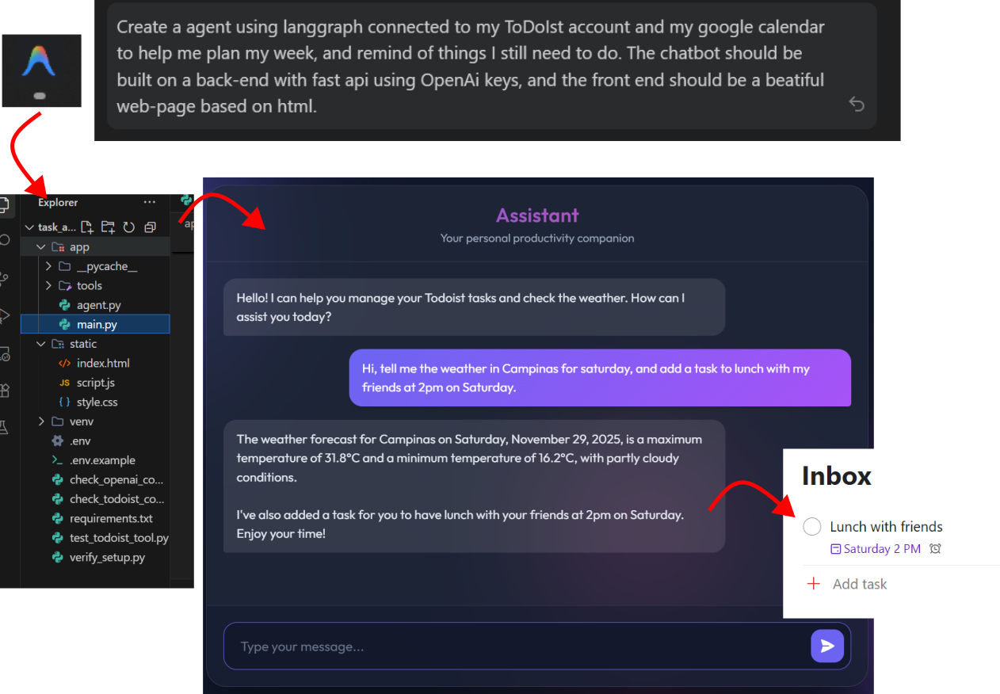

# Personal Assistant Agent for Tasks Management



## 📋 Introduction

This project started as an experiment to see what **Google Antigravity** could build from scratch using generative AI. The goal was to demonstrate just how powerful AI-assisted development has become by creating a fully functional personal assistant agent that actually does useful stuff.

What you're looking at is a **Personal Assistant Agent** that talks to your Todoist account to manage tasks and fetches weather information to help you plan your day. It uses **LangGraph** and **OpenAI's GPT-4** to understand what you're asking in plain English and then takes action—whether that's adding a task, checking your to-do list, or telling you if you need an umbrella tomorrow.

The whole thing was generated through conversations with Antigravity, from the backend API to the frontend interface. Pretty impressive, right?

### 🎯 Project Purpose

This isn't meant to be a production-ready app (more on that below). Instead, it's a **proof of concept** showing how AI can rapidly prototype and build functional applications. The entire codebase—the FastAPI backend, LangGraph agent setup, tool integrations, and web interface—was created through iterative prompts and AI-generated code.

### ⚠️ Important Disclaimer

Humans are still necessary. Specially, for thinking what we want, and how we want the solution to be. AI generated content is great, but humans give the actual value to the product.

## ✨ Features

- 🤖 **AI-Powered Conversations** - Natural language interaction using OpenAI GPT-4
- ✅ **Task Management** - View and add tasks to your Todoist account
- 🌤️ **Weather Information** - Get current weather and forecasts for any location
- 🎨 **Modern Web Interface** - Clean, responsive UI for seamless interaction
- 🔧 **LangGraph Integration** - Sophisticated agent workflow with tool calling
- ⚡ **Real-time Updates** - FastAPI backend with hot-reload support

## 🛠️ Prerequisites

Before running this project, make sure you have the following:

- **Python 3.8+** installed on your system
- **OpenAI API Key** - [Get one here](https://platform.openai.com/api-keys)
- **Todoist API Key** - [Get one here](https://todoist.com/app/settings/integrations/developer)

## 📦 Installation

Follow these steps to set up the project on your local machine:

### 1. Clone the Repository

```bash
git clone https://github.com/yourusername/task_and_weather_agent.git
cd task_and_weather_agent
```

### 2. Create a Virtual Environment

```bash
# Windows
python -m venv venv
.\venv\Scripts\activate

# macOS/Linux
python3 -m venv venv
source venv/bin/activate
```

### 3. Install Dependencies

```bash
pip install -r requirements.txt
```

### 4. Configure Environment Variables

Create a `.env` file in the root directory by copying the example file:

```bash
cp .env.example .env
```

Then edit the `.env` file and add your API keys:

```env
OPENAI_API_KEY=your_openai_api_key_here
TODOIST_API_KEY=your_todoist_api_key_here
```

## 🚀 How to Run

### Start the Development Server

```bash
# Make sure your virtual environment is activated
.\venv\Scripts\activate  # Windows
# or
source venv/bin/activate  # macOS/Linux

# Run the FastAPI server with hot-reload
uvicorn app.main:app --reload
```

Alternatively, you can use:

```bash
python -m uvicorn app.main:app --reload
```

### Access the Application

Once the server is running, open your browser and navigate to:

```
http://localhost:8000
```

You should see the web interface where you can start chatting with your personal assistant!

### API Documentation

FastAPI automatically generates interactive API documentation. You can access it at:

- **Swagger UI**: http://localhost:8000/docs
- **ReDoc**: http://localhost:8000/redoc

## 🗂️ Project Structure

```
task_and_weather_agent/
├── app/
│   ├── agent.py           # LangGraph agent configuration
│   ├── main.py            # FastAPI application entry point
│   └── tools/
│       ├── todoist.py     # Todoist integration tools
│       └── weather.py     # Weather API tools
├── static/                # Frontend HTML/CSS/JS files
├── assets/                # Documentation images and assets
├── .env                   # Environment variables (not in git)
├── .env.example           # Example environment configuration
├── .gitignore            # Git ignore rules
├── requirements.txt       # Python dependencies
└── README.md             # This file
```

## 🔧 Available Tools

The agent has access to the following tools:

### Task Management (Todoist)
- **`get_tasks`** - Retrieve your tasks from Todoist
- **`add_task`** - Create new tasks in Todoist

### Weather Information
- **`get_current_weather`** - Get current weather for a location
- **`get_forecast`** - Get weather forecast for upcoming days

## 💬 Example Queries

Try asking the assistant questions like:

- "What tasks do I have today?"
- "Add a task to buy groceries"
- "What's the weather like in New York?"
- "Show me the forecast for this week"
- "What should I work on today?"

## 🧪 Testing

The project includes several test scripts to verify your setup:

```bash
# Test OpenAI connection
python check_openai_connection.py

# Test Todoist connection
python check_todoist_connection.py

# Test Todoist tool
python test_todoist_tool.py

# Verify complete setup
python verify_setup.py
```

## 🤝 Contributing

Contributions are welcome! Feel free to:

1. Fork the repository
2. Create a feature branch (`git checkout -b feature/amazing-feature`)
3. Commit your changes (`git commit -m 'Add amazing feature'`)
4. Push to the branch (`git push origin feature/amazing-feature`)
5. Open a Pull Request

## 📄 License

This project is open source and available under the MIT License.

## 🙏 Acknowledgments

- Built with [Google Antigravity](https://deepmind.google/technologies/gemini/antigravity/)
- Powered by [OpenAI GPT-4](https://openai.com/)
- Task management via [Todoist](https://todoist.com/)
- Built with [LangGraph](https://github.com/langchain-ai/langgraph) and [FastAPI](https://fastapi.tiangolo.com/)

---

**Made almost entirely using Google Antigravity**
